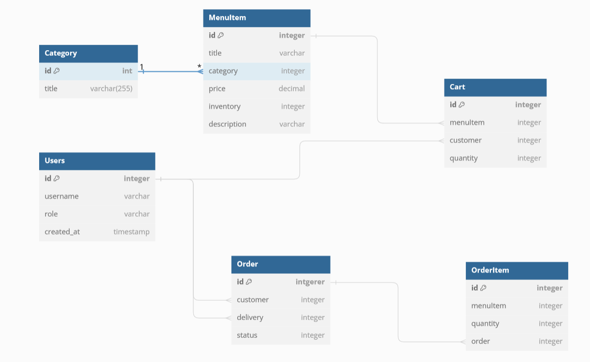

# Plan
1. Create everything by yourself without looking anywhere.
    1. Create virtual environment with needed packages
        - djangorestframework, django
    2. Create project LittleLemon and App LittleLemonAPI
    3. Design and create database schema from [project decriptions](../../README.md#4-week-recap-and-project)
        - perform migrations
    4. Create superuser and create needed user roles using admin site + create several users with different roles
        - Manager
        - Delivery crew
    5. Start designing views and serializers
        - Only class-based and function-based views available for the task (no generics and viewsets)
        - Consider user roles
    6. Test everything accordingly using insomnia and browsable api
2. Watch "creating models" video and change already created schema accordingly


Questions
- How to define on_delete policy for database relations?
- How does related name used?
- How to use related fields serializers with post calls in APIView?
- How to pass existing object for serializer to save?
    - instead of getting object via model and assigning fields during put request, just pass data to serializer and use save method

## Step by step guide
1. Creating environment
```bash
pipenv shell
pipenv install django
pipenv install djangorestframework
```
2. Creating a project and an app
```bash
django-admin startproject LittleLemon .
python3 manage.py startapp LittleLemonAPI
```
- Registering app
3. Database schema
    0. What are entities used in project?
        - Category
            - title
        - MenuItem
            - title, description, category, price, inventory
        - Cart
            - customer (FK), menuItem, quantity
            - One user to many CartItems (one to many)
            - one menu item many cart items instances
        - OrderItem
            - order (FK), customer, menuItem, quantity
            - one order - many orderitems
            - one customer, many order items
        - Order
            - deliverycrew, status
    - 
    1. Code models
    2. Make migrations
    - Ask yourself about on_delete policy
4. Create super users and roles
5. Create views and serializers
    1. Create views for littleLemonAPI without any authorization and authentication
        - menu-items
        - menu-items/{itemId}
        - cart/menu-items
        - orders
        - orders/{orderId}
    2. Create propper user management system
        - users
        - token/login
        - groups/manager/users
        - groups/manager/users/{userId}
        - groups/delivery-crew/users
        - groups/delivery-crew/users/{userId}
    3. Work with authorizations for every view


- TIP
    - it's better to make one fully right view and then continue with another.