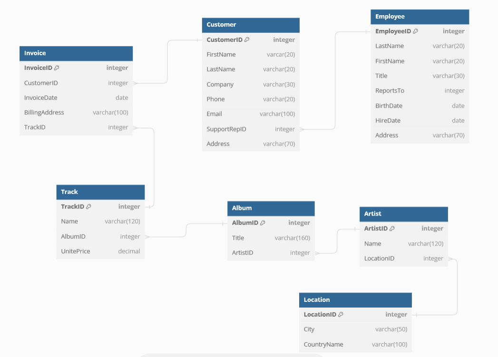

# Assignments
Format
week: title
description, questions, some needed theory

MySQL on platform

## 1: Module Quiz
Questions:
- Types of databases and their differences?
- Relational databases concepts? Entity, Table, Record, Instance, Field, Column etc
- What is sql advantages?
- What are SQL commands? What are subsets?
    - DML
    - DQL
    - DDL
    - TCL
- Types of keys in RDB? Candidate, Primary, Foreign, Alternate etc

## 2: Working with numbers exercise
CM mobiles company db;
Store information about mobile devices to sell.
And about stock
#### Task 1 - create database
```SQL
-- t1
CREATE DATABASE cm_devices;

USE cm_devices; -- selecting db to use mysql cli
```

#### Task 2 - design and create a table
- Designing a table
    - Identify name for a table `devices`
    - Identify the data type for each column
        - Device ID `Integer` `Primary key` ~ `INT`
        - Device name. `VARCHAR` or `TEXT`
        - Price. `DECIMAL`
- Write an sql statement
```SQL
--t2 creating table
CREATE TABLE devices (
    deviceID int,
    deviceName varchar(50),
    price decimal
);
```
- `show tables;` mysql cli
- `show columns from devices;` mysql cli

#### Additional task
- Create a new table that contains quantity and total price of devices in the stock.
1. Indentify an appropriate table name `stock`
2. Identify columns and their datatypes
    - deviceID int
    - quantity int
    - totalPrice decimal
3. write a full sql statement `create table stock (deviceID int, quantity int, totalPrice decimal)
```SQL
create table stock (
    deviceID int,
    quantity int,
    totalPrice decimal
)
```

Questions:
- Can primary key be used as foreign key to another table? One to one relationship
- How to create a table and a database?
- What are data type groups and types?
- How to alter a field to be a primary key? `ALTER TABLE table ADD PRIMARY KEY (field)`
- `ALTER TABLE table MODIFY COLUMN col datatype auto_increment;`
- How to alter a field to be a foreign key?
- Decimal and integer datatypes features?


## 2: Working with strings
CHAR and VARCHAR datatypes differences and how they work?

Table about customers. Username, Full name, email, 

Mysql prompt: Creating a database `cm_devices`. Select for use. 
- show tables; show databases; show columns from table;

**Algorithm:**
1. Identify suitable table name for a table
2. Identify datatypes and column names, keys etc.
3. Write an sql statement

#### Creating the table
1. customers
2. Columns
- username format `Custom999` - 9 character long - CHAR(9)
- full name expected length VARCHAR(100)
- email VARCHAR(255)
3. create table customers (username CHAR(9), fullName varchar(100), email varchar(255));

#### Additional
Store customers feedback
1. feedback
2. Colums
- feedback id format `Feed9999` - CHAR(8)
- feedback type - max 100; VARCHAR(100) - how to use selection?
- comment - max 500; TEXT(500)

#### SQL
```SQL
create database cm_devices;

use cm_devices;

create table customers (username char(9), fullName varchar(100), email varchar(255));

create table feedback (feedbackID char(8), feedbackType varchar(100), comment text(500));
```

#### Questions
- What are the differences between CHAR, VARCHAR and TEXT datatype?
    - max length, dynamic or static etc.
- What are other string datatypes?
- How to use selection of datatypes? (select list)


## 2: Working with default values
Using a **default constraint**
cm mobiles

Storing addresses for clients. CustomerID, Street, Postcode, Town

Mysql prompt: Creating a database `cm_devices`. Select for use. 
- show tables; show databases; show columns from table;

**algo**
1. Identify the column the requires default values. (Identify constraints)
2. Write an sql to create constraints

#### Creating a table
- Default city `Harrow`
- Identify not null constraint for id
1. address
2. columns
- customer id - int not null
- street - varchar(255)
- postcode - varchar(10)
- town - varchar(30) **DEFAULT** "Harlow"
3. `create table address (customerID int not null, street varchar(255), postcode varchar(10), town varchar(30) default "harrow");`

#### Additioinal
Also postcode `HA97DE` is default.
Drop table and create new

#### SQL
```SQL
-- creating database and selecting it

create table address (customerID int not null, street varchar(255), postcode varchar(10), town varchar(30) default "Harrow");

drop table address;

create table address (
    customerID int not null,
    street varchar(255),
    postcode varchar(10) default "HA97DE",
    town varchar(30) default "Harrow");

-- or ALTER TABLE address MODIFY COLUMN postcode varchar(10) default "HA97DE";
```

#### Questions
- How to add constraints to a table?
- What are types of constraints?
- How to use default and not null constraints?


## 2: Choosing the right datatype for a column
Using different datatypes: decimal, int, string, date
invoices table to generate invoices: customer name, order date, product quantity, total price

Mysql prompt: Creating a database `cm_devices`. Select for use. 
- show tables; show databases; show columns from table;

**algo**
1. table name
2. columns and datatypes + constraints
    - Think what kind of values you expect and identify a datatype
3. write complete sql statement.

#### Task
1. invoices
2. columns
    - customer name - varchar(255)
    - order date - date
    - product quantity - int
    - total price - decimal
3. `create table invoice (customerName varchar(255), orderDate date, productQuantity int, totalPrice decimal);

#### Additional
contact details: account number int, phone int, email varchar

#### SQL
```SQL
-- create/select db

create table invoice (customerName varchar(50), orderDate date, quantity int, price decimal);

create table contacts (accountNumber int, phone int, email varchar(255));
```

#### Questions
- What are naming conventions for db names, tables and field names?
    - [MVP](https://stackoverflow.com/questions/338156/table-naming-dilemma-singular-vs-plural-names)


## 2: Create db, create table, insert data.
Step by step create db, table, insert data (populate).

Bookshop - customers 

Mysql prompt: Creating a database `bookshop`. Select for use. 
- show tables; show databases; show columns from table;

#### Task
1. Create database bookshop
2. create table customers
    - columns
        - customerID int not null primary key auto_increment
        - name varchar(50)
        - address varchar(255)
3. insert data `INSERT INTO table (col1, col2 ...) VALUES (val1, val2 ...), ...`
    - 1, "Jack", "115 Old street Belfast"
4. select statement to check

#### Additional
- insert: 2, "James", "24 Carlson Road, London"

#### SQL
```sql
-- Create/select db
create table customer (
    id int primary key auto_increment,
    name varchar(50),
    address varchar(255)
);

insert into customer (id, name, address) values 
    (1, "Jack", "115 Old street Belfast"),
    (2, "James", "24 Carlson Road, London");

select * from customer;
```

#### Question
- Does pk means not null too?


## 2: Practicing table creation
Footbal club -> players table -> id, name, age

#### Task
1. create database `footbal_club`
2. create table `player`

#### Additional
games of team -> id, date, score

#### SQL
```sql
-- create/select db
create table player (
    id int primary key auto_increment,
    name varchar(50),
    age int
);

create table game (
    id int primary key auto_increment,
    date date,
    score int
)
```

#### Questions
- What if auto_increment isn't used?
- When can I omit columns while inserting?


## 2: Record deletion
bookshop -> customer -> id, name, address
remove a customer with id 3

#### Task
1. truncate table
2. Populate it
3. Use delete from table where to delete customers

#### SQL
```sql
-- create/select db

truncate table customers;

INSERT INTO 'customers' ('customerID', 'customerName', 'customerAddress') VALUES
(1, 'Jack', '115 Old street Belfast'),
(2, 'James', '24 Carlson Rd London'),
(4, 'Maria', '5 Fredrik Rd, Bedford'),
(5, 'Jade', '10 Copland Ave Portsmouth '),
(6, 'Yasmine', '15 Fredrik Rd, Bedford'),
(3, 'Jimmy', '110 Copland Ave Portsmouth');

delete from customers
where customerID = 3;

delete from customers
where customerID = 6;
```

#### Questions
- Does sql consider register of names?
- Can quotation be used with column and db names? 

## 2: Module Quiz
#### Questions
- CRUD operations in sql?
    - create drop database
    - create, drop, truncate table
    - delete from table
    - update table
    - insert into table
    - insert into select
    - select


## 3: ORDER BY and WHERE
use order by and where clause
`chinook sample` db for demos and exercises.


#### Initialization of db
```sql
CREATE DATABASE Chinook;
USE Chinook;

CREATE TABLE Customer (CustomerId INT NOT NULL, FirstName VARCHAR(40) NOT NULL, LastName VARCHAR(20) NOT NULL, Company VARCHAR(80), Address VARCHAR(70), City VARCHAR(40), State VARCHAR(40), Country VARCHAR(40), PostalCode VARCHAR(10), Phone VARCHAR(24), Fax VARCHAR(24), Email VARCHAR(60) NOT NULL, SupportRepId INT, CONSTRAINT PK_Customer PRIMARY KEY (CustomerId));

INSERT INTO Customer (CustomerId, FirstName, LastName, Company, Address, City, State, Country, PostalCode, Phone, Fax, Email, SupportRepId) VALUES (1, 'Luís', 'Gonçalves', 'Embraer - Empresa Brasileira de Aeronáutica S.A.', 'Av. Brigadeiro Faria Lima, 2170', 'São José dos Campos', 'SP', 'Brazil', '12227-000', '+55 (12) 3923-5555', '+55 (12) 3923-5566', 'luisg@embraer.com.br', 3);

INSERT INTO Customer (CustomerId, FirstName, LastName, Company, Address, City, State, Country, PostalCode, Phone, Fax, Email, SupportRepId) VALUES (2, 'Eduardo', 'Martins', 'Woodstock Discos', 'Rua Dr. Falcão Filho, 155', 'São Paulo', 'SP', 'Brazil', '01007-010', '+55 (11) 3033-5446', '+55 (11) 3033-4564', 'eduardo@woodstock.com.br', 4);

INSERT INTO Customer (CustomerId, FirstName, LastName, Company, Address, City, State, Country, PostalCode, Phone, Fax, Email, SupportRepId) VALUES
(3, 'Alexandre', 'Rocha', 'Banco do Brasil S.A.', 'Av. Paulista, 2022', 'São Paulo', 'SP', 'Brazil', '01310-200', '+55 (11) 3055-3278', '+55 (11) 3055-8131', 'alero@uol.com.br', 5);

INSERT INTO Customer (CustomerId, FirstName, LastName, Company, Address, City, State, Country, PostalCode, Phone, Fax, Email, SupportRepId) VALUES
(4, 'Roberto', 'Almeida', 'Riotur', 'Praça Pio X, 119', 'Rio de Janeiro', 'RJ', 'Brazil', '20040-020', '+55 (21) 2271-7000', '+55 (21) 2271-7070', 'roberto.almeida@riotur.gov.br', 3);

INSERT INTO Customer (CustomerId, FirstName, LastName, Company, Address, City, State, Country, PostalCode, Phone, Fax, Email, SupportRepId) VALUES (5, 'Mark', 'Philips', 'Telus', '8210 111 ST NW', 'Edmonton', 'AB', 'Canada', 'T6G 2C7', '+1 (780) 434-4554', '+1 (780) 434-5565', 'mphilips12@shaw.ca', 5);

INSERT INTO Customer (CustomerId, FirstName, LastName, Company, Address, City, State, Country, PostalCode, Phone, Fax, Email, SupportRepId) VALUES (6, 'Jennifer', 'Peterson', 'Rogers Canada', '700 W Pender Street', 'Vancouver', 'BC', 'Canada', 'V6C 1G8', '+1 (604) 688-2255', '+1 (604) 688-8756', 'jenniferp@rogers.ca', 3); 
```

#### Task 1 - display all data
select * from table

#### Task 2 - sort
select * from table
order by FirstName;

#### Task 3 - filter
select *
from table
where Country = "Canada"
order by FirstName;

#### Additional - display only name and country

#### SQL
```sql
-- Create/select database. Create table. populate

select *
from Customer;

select *
from Customer
order by FirstName;

select *
from Customer
where Country = "Canada";

select *
from Customer
where Country = "Canada";
order by FirstName;

select FirstName, Country
from Customer
where Country = "Canada"
order by FirstName;

SELECT CONCAT(FirstName, " ", LastName) as Name, Country
FROM Customer
WHERE Country = "Canada"
ORDER BY FirstName;
```


## 3: Module Quiz
#### Questions
- How to filter using WHERE?
- How to sort using ORDER BY and ASC, DESC keywords?
- What does SELECT DISTINCT do?


## 4: Database Schema Examples
Chinook database example.

**Algo**
1. Define the database purpose.
2. Identify the database table including
    - Attributes
    - Attr data types
    - Primary key for each table
3. Create relationships between tables

#### Task 1: Identify the database purpose
A fictitious digital media company that includes information about
- artists
- albums
- media tracks
- invoices
- customers

#### Task 2: Identify 6 main tables with a brief description and a primary key for each table.
- Employees - 8 attributes. Employee ID - pk

- Customers - 8 attributes. Customer ID - pk

- Invoices - 5 attributes. Invoice ID - pk

- Artists - 2 attributes. Artist ID - pk. Artist name

- Albums - 3 attributes. Album ID - pk

- Tracks - 5 attributes. Track ID - pk


#### Task 3: Identify the relationships between the 6 main tables.
- Each employee will support one or many customers
    - **Customer has assigned employee?**
    - One employee - many customers
    - Customer has FK Employee
- Each customer may have multiple invoices.
    - Invoice has FK Customer.
    - One customer - Many invoices
- Each track belongs to one album
    - Track has FK Album
    - One Album - Many Tracks
- Each invoice related to one track
    - Invoice has FK Track
    - One Track - Many Invoices
- Each artist has one or multiple albums
    - Album has FK Artist
    - One artist - Many Albums

#### Task 4: Create an entity relationship diagram of the 6 main tables. 
- Create ERD


#### Additional
Add new table location - city and country where the artist lives
- One to Many relationship - how to implement
- One location - Many artists
- FK locationId to artist

#### ERD design
```erd
// Use DBML to define your database structure
// Docs: https://dbml.dbdiagram.io/docs

Table Employee {
  EmployeeID integer [primary key]
  LastName varchar(20)
  FirstName varchar(20)
  Title varchar(30)
  ReportsTo integer
  BirthDate date
  HireDate date
  Address varchar(70)
}


Table Customer {
  CustomerID integer [primary key]
  FirstName varcar(20)
  LastName varchar(20)
  Company varchar(30)
  Phone varchar(20)
  Email varchar(100)
  SupportRepID integer
  Address varchar(70)
}

Table Invoice {
  InvoiceID integer [primary key]
  CustomerID integer
  InvoiceDate date
  BillingAddress varchar(100)
  TrackID integer
}

Table Artist {
  ArtistID integer [primary key]
  Name varchar(120)
  LocationID integer
}

Table Album {
  AlbumID integer [primary key]
  Title varchar(160)
  ArtistID integer
}

Table Track {
  TrackID integer [primary key]
  Name varchar(120)
  AlbumID integer
  UnitePrice decimal
}

Table Location {
  LocationID integer [primary key]
  City varchar(50)
  CountryName varchar(100)
}

Ref: Customer.SupportRepID > Employee.EmployeeID

Ref: Customer.CustomerID < Invoice.CustomerID

Ref: Invoice.TrackID > Track.TrackID

Ref: Album.ArtistID > Artist.ArtistID

Ref: Track.AlbumID > Album.AlbumID

Ref: Artist.LocationID > Location.LocationID
```


#### Questions
- What is database schema? What are types and examples for each type.
- What is ERD?
- How to create different type of relationships - examples?
- How to make a foreign key in sql (syntax)?

## 4: Module Quiz
- Normalization forms
- Database schema types and their differences?
- Types of data anomalies?

## 5: Final Quiz
- CRUD operations
- Constraints, Foreign, Primary key separately
- using operators
