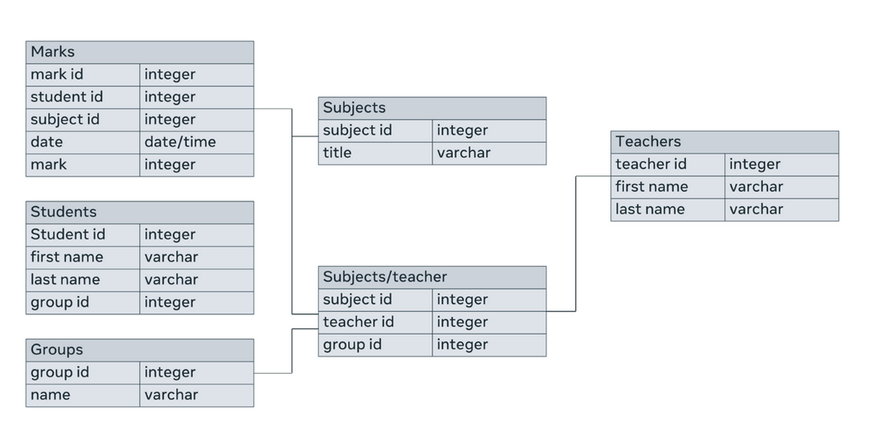
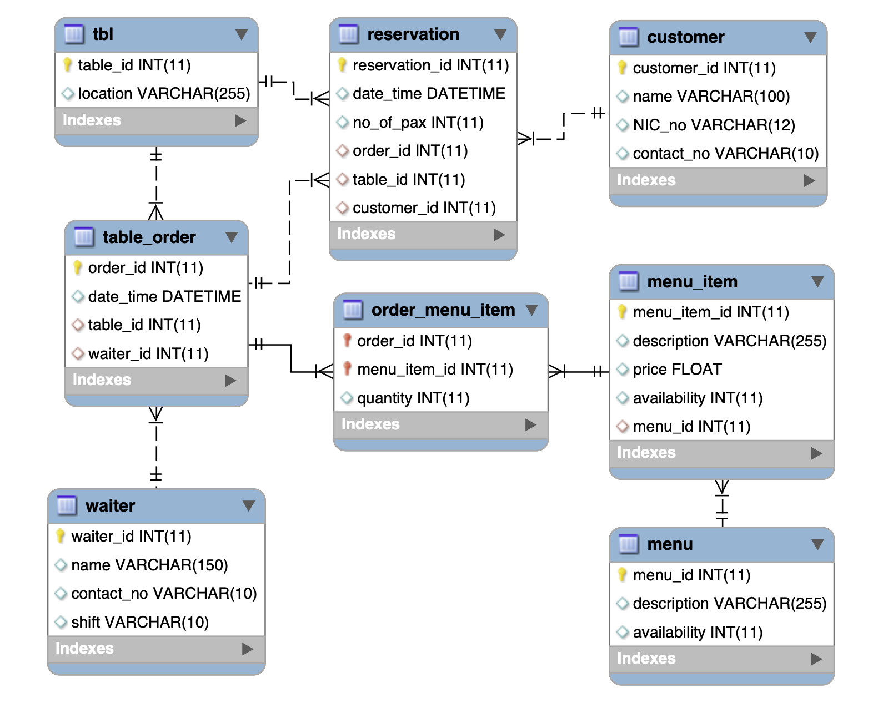
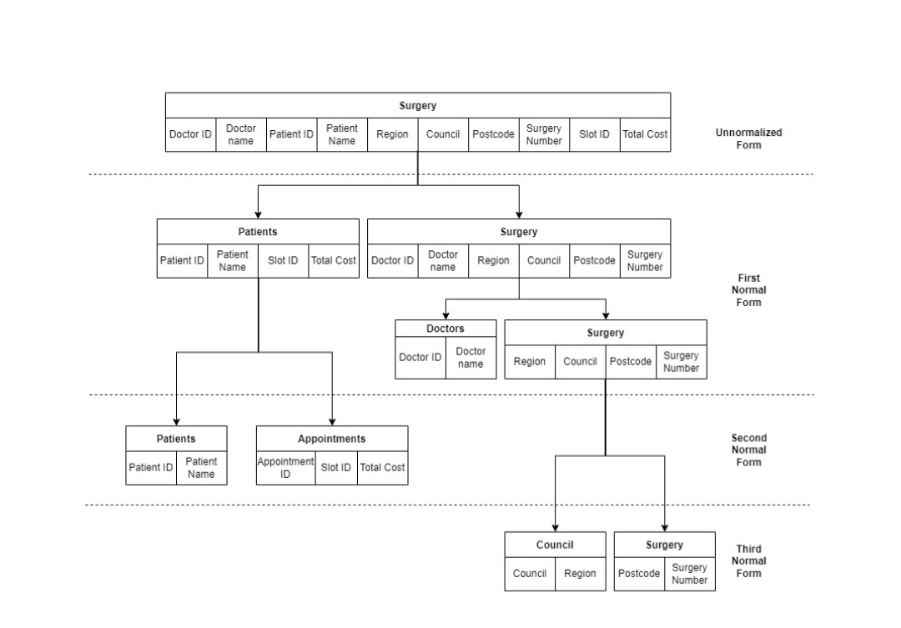

## Prestudy

- Databases, data
- SQL
    - CRUD
    - Clauses (WHERE, ORDER BY etc)
- Database design

## Time Required
5 weeks 1.5-3 hours = 7.5-15 (27 h on certificate page)
3h video + 8h reading = 11 h material
5 graded + labs

## Tools
- [SQL online ide](https://sqliteonline.com/)

## 1 WEEK: Database, DB Structure, Types of Data, Tables
### Course Intro
- What is Database - storage of DATA
    - IOT
    - Big Data
- DB operations
    - Store Data
    - Form connections between segmented areas of data
    - Filter Data
    - Search Data
    - Perform CRUD operations
- Course
    - Concepts of DATA and database
    - CRUD
    - SQL
        - normalization
    - Stamp software - practice

### Database and Data
- **Data** - Facts and Figures about anything
- **Database** - electrical storage of Data
    - Before data was stored in files
    - Efficient, Secure, Managable
    - Systematically
        - **Identifiers** (features) of real or conceptual objects
        - Stored in entities (spreadsheets or tables)
            - Entity ~ Table
                - Attributes - Fields - Columns - **related** to some element
                - Instances - Records - Rows
    - Other types of Databases
        - Object Oriented DB
        - Graph DB (Vertices and Edges(relations))
        - Document DB (collections and objects)
    - Where Stored?
        - Dedicated Machine
        - Cloud
            - low-cost
            - via internet
- **Relation**
    - Database structure
        - Fields - Attributes or columns
        - Records - instances or rows - should be uniquely identifiable
            - Primary key field for identification
        - Entity - Type of objects that stored in db table
    - Foreign key - primary key in another table to create relationship between entities
- Charts - data representation
    - Bar Charts
    - Bubble chart
    - Line Charts
    - Pie Chart
    - Area chart, dual axis, Gantt, Heat maps, scatter plot chart
    - How to choose?
        - Target audience, idea, goal
- Types of DB
    - SQL - structured
    - unstructured for AI, Social Media, IOT
    - NoSQL - semi-structured or unstructured -> variety of different formats
        - Can be scaled easily
        - Graph, Document, Key-Value DB
    - BigData - Data that can increase exponentionally in volume with time
        - Millions of users actions, IOT
        - Combination of structured, unstructured or semi structured
        - Unique insights -> desicion making
    - Cloud DB - free from infrastructure issues of DB
    - Business Intelligence
- DB evolution
    - Flat Files, Hierarchical, network
        - Flat files (CSV)
        - Hierarchical - one to many relationship
        - network - many to many
    - Relational
        - Tables with attributes/columns and records/rows.
        - Relations - Foreign key that primary key in another table
    - Object-Oriented, object-relational, web-enabled
        - Object-Oriented
    - NoSQL - speed and flexibility in storing data
        - unstructured data
        - Higher scalability, distributed, lower cost, flexible schema, no complex relationships
        - Types
            - Document (Json)
            - Key-Value
            - Wide-column
            - Graph
- Additional resources
    - [Oracle](https://www.oracle.com/uk/database/what-is-database/)
    - [Javapoint](https://www.javatpoint.com/types-of-databases)
    - [IBM](https://www.ibm.com/cloud/learn/relational-databases)
    - [Tutorialspoint](https://www.tutorialspoint.com/Types-of-databases)
    - [Graphdatamodeling](http://graphdatamodeling.com/GraphDataModeling/History.html)

### SQL intro
- SQL - structured query language - used to communicate with DB
    - works with all kinds of DB but good with relational
    - CRUD operations
        - Create, Read, Update, Delete
    - SQL subsets or sublanguages
        - DDL - Data Definition Language - creating and manipulating tables
            - *create, alter, drop table*
        - DML - Data Manipulation Language - CrUD
            - *Insert, Update, Delete*
        - DQL - Data Query Language - cRud
            - *select*
        - DCL - Data Control Language - access of users
            - revoke, grant
    - DBMS - Database Management System - system that interpret sql queries so DB can understand it
    - Advantages
        - Simple - just keywords + interractive
        - Standard - any database uses it
        - Portable - on any hardware
        - Processing - large amount of data efficiently
        - Comprehensive - Provide all needed for db management and administration
- Database of a college
- Syntax
```sql
-- DDL
CREATE DATABASE college;

CREATE TABLE Student (col_name1 datatype(size), col_name2 datatype(size));

DROP DATABASE college;
DROP TABLE Student;

ALTER TABLE Student ADD (col_name datatype(size));
ALTER TABLE Student ADD primary key (col_name);

TRUNCATE TABLE Student; --delete all data from the table but not table
-- DML
INSERT INTO Student (col1, col2 ...)
VALUES (val1, val2 ...), (val1, val2 ...);

UPDATE Student
SET col = val, ,col2 = val2
WHERE ID = '01'; -- Where clause + condition

DELETE FROM Student
WHERE ID = '02';

-- DQL
SELECT col1, col2 -- * - all columns
FROM Student
WHERE ID = '03';

-- DCL - GRANT, REVOKE - add and remove permissions (priviliges) for and from users

-- TCL - Transaction Control Language - COMMIT, ROLLBACK
-- Grouping SQL DML statements into logical transactions
```
- populate
- Additional Resources
    - [Javapoint](https://www.javatpoint.com/dbms-sql-introduction)
    - [Beginnersbook](https://beginnersbook.com/2018/11/introduction-to-sql/)

### Basic db structure
- Database stores tables
    - Table or Entity or Object or Relations (tables in DB related) stores data in rows and cols
        - col or attribute or field has unique name and datatype
            - Supported Data types depend on DB system
                - Strings, Numeric, Date and Time, Binary
            - Domain - set of legal values for data type
        - row or **record** or instance 
            - Primary Key - unique value col for each instance to be identified
- Tables - rows, cols, cells
    - Datatypes
        - Numeric: INT, BIGINT, FLOAT, REAL, TINYINT
        - Strings: CHAR, VARCHAR
        - DateTime: DATE, TIME, DATETIME
        - Binary: BINARY, VARBINARY
        - Miscellaneous: Character Large Object (CLOB), Binary Large Object(BLOB)
    - Table in relational database known as relation. Record = tuple
        - DB Schema
            - Table name, Attributes, Types of attributes, 
    - Primary Key - Identifier of a record, thus **unique**
        - Composite Primary key - composite of several attributes
    - Foreign Key - key to create relation. It's a primary key from related table.
    - Constraints
        - Key constraints - All tables should contain Not NULL Primary key to fetch data
        - Domain Constraints - Data should be stored semantically and by its type
        - Referential integrity constraints - If some records linked by foreign key they should exist in another table. (cascade delete)
- DB Structure
    - Table or entity
        - Attributes - description of Entity
            - Fields - columns for attributes
            - Unit of data (cell)
                - Datatypes (look above)
        - Records - rows in table
        - Primary key unique for an entity
    - Logical structure (ERD - entity relationship diagram) (DBMS)
        - Shows relationship between entities (cardinality of relationship)
            - One to One
            - One to Many
            - Many to Many
        - 
    - Physical Structure
        - Implementation of DB tables => Foreign Key <-> Primary Key
- Relational DB based on Entities and relation between them
    - Types of keys
        - Key - unique attribute to identify data
        - Candidate key - unique attribute
            - Primary key - chosen candidate
            - Alternate key - not chosen candidate
        - Composite Key
        - Foreign Key
    - *Avoid using multivalue types in relational DB => use simple types*

### Summary
- Data and DB concept
    - DB usage
    - History and Types of DB
- SQL
    - subsets
        - DDL
        - DML
        - DQL
        - DCL
        - TCL
    - Advantages: Portability, Easy to use, Effectiveness, Can be used with any type of DB
- DB structure
    - Table, rows, cols, unit of data
    - Constraints
        - Key, Domain, Referential
    - Types of Keys
    - Logical and Physical Structure
- Additional Resources
    - [Microsoft](https://support.microsoft.com/en-us/office/database-design-basics-eb2159cf-1e30-401a-8084-bd4f9c9ca1f5)
    - [IBM](https://www.ibm.com/docs/en/control-desk/7.6.0?topic=design-relational-database-structure)


## 2 WEEK: SQL Data types. CRUD.
### Datatypes
- Table in database consist of rows and cols
    - cols has name and datatype (thus domain or valid values)
    - Common datatypes: Numeric, String, DateTime
- Numeric Datatypes: Integer, Decimal(float)
    - Numeric datatypes has max and min possible values
        - (MySQL): TINYINT <= 255. INT <= 4mil+
    - Also you can define if the numbers should be *positive* and *negative*
- String Datatypes: CHAR, VARCHAR, TEXT
    - CHAR - fixed size of each value
    - VARCHAR - variable size of each value
    - TEXT
        - TINYTEXT - 256
        - TEXT - 65k
        - MEDIUMTEXT - 16mil
        - LONGTEXT - 4GB
- Constraints - Rules on column or table level to check if inserted/updated data is valid.
    - NOT NULL and DEFAULT
    ```SQL
    CREATE TABLE Team_Members (
        Name VARCHAR(50) NOT NULL,
        City VARCHAR(30) DEFAULT "Barcelona"
    );
    ```
- Additional Resources
    - https://www.w3schools.com/sql/sql_datatypes.asp
    - https://www.w3resource.com/mysql/mysql-data-types.php
    - https://learnsql.com/blog/understanding-numerical-data-types-sql/
    - https://docs.microsoft.com/en-us/sql/t-sql/data-types/decimal-and-numeric-transact-sql?view=sql-server-ver16s
    - https://dev.mysql.com/doc/refman/8.0/en/numeric-types.html

### Create and Read
- Use this commands with bookstore and students db.
```SQL
CREATE DATABASE db_name;
DROP DATABASE db_name;

CREATE TABLE table_name (col1 datatype1, col2 datatype2, ...)

ALTER TABLE table_name ADD (new_col1 datatype1, new_col2 datatype2)
ALTER TABLE table_name DROP COLUMN col_name;
ALTER TABLE table_name MODIFY old_col datatypechange

INSERT INTO table_name (col1, col2, col3 ...) VALUES
    (val11, val12, val13, ...),
    (val21, val22, val23, ...);

SELECT * FROM table_name
```
- Tips in creating tables
    - meaningful names for table and attributes
    - Sheet with supported datatypes for your db system
    - specify the size where needed (f.e. varchar)
```SQL
SELECT * FROM table_name
SELECT col1, col2 ... FROM table_name

INSERT INTO table_1 (col1) SELECT col FROM table_2
INSERT INTO country (name) SELECT DISTINCT country FROM players;
```

- Additional Resources
    - https://www.tutorialspoint.com/sql/index.htm
    - https://www.javatpoint.com/sql-tutorial
    - https://www.tutorialrepublic.com/sql-tutorial/sql-create-database-statement.php

### Update and Delete
```SQL
UPDATE table_name
SET col1 = val1, col2 = val2
WHERE condition;

DELETE FROM table_name;
DELETE FROM table_name
WHERE condition;
```

### Summary
- SQL
    - CRUD
    - insert into
    - Alter
    - Select + Insert into select
- Constraints (NOT NULL, DEFAULT)
- Datatypes
    - Numeric (Integer, Decimal)
    - String (Char, varchar)
    - Others

- Additional resources
    - https://www.tutorialspoint.com/sql/index.htm
    - https://www.javatpoint.com/sql-tutorial
    - https://www.w3schools.com/sql


## 3 WEEK: SQL operators, sorting and filtering
### Operators

- Operators take 2 operands and return result
```SQL
select 5 + 5;
```
- Arithmetic operators: + - * / %
    - Can be used in SELECT clause or WHERE clause
- Comparison operators: <, <=, >, >=, =, !=(<>)
    - Used for filtering data
- Additional resources
    - https://www.w3schools.com/sql/sql_operators.asp
    - https://www.javatpoint.com/sql-arithmetic-operators
    - https://www.tutorialspoint.com/sql/sql-operators.htm
    - https://www.w3resource.com/sql/comparison-operators/sql-comparison-operators.php

### Sorting and Filtering data
- Sorting - ***ORDER BY*** clause
    - ASC keyword - default order
    - DESC keyword
```SQL
SELECT * FROM table_name
ORDER BY col1 ASC, col2 DESC;
```
- Filtering - ***WHERE*** clause
    - Comparison operators (>, <, >=, <=, <>(!=), =, !<, !>)
    - Logical operators (ALL, ANY, AND, OR, BETWEEN, LIKE, IN, EXISTS, IS NULL, NOT, UNIQUE)
    - LIKE - pattern `col LIKE pattern`
        - wildcard symbols
        - `%` - 0, 1 or more characters
        - `_` only 1 character
    - BETWEEN - range   `col BETWEEN val1 AND val2`
    - IN - multiple values `col IN (val1, val2 ...)`
```sql
SELECT * FROM table_name
WHERE condition
-- col <> = <= >= < > value
```
- Filtering unique - ***SELECT DISTINCT***
    - eliminates duplicate value combination and select query result
    - NULL considered as unique value
    - Can be used with aggregate functions (AVG, MAX, MIN, SUM)
```sql
SELECT DISTINCT col1, col2 FROM table_name;

SELECT AVG(DISTINCT col)
FROM table_name;
```

### Module summary
- Datatypes and arithmetic operators
- Logical Operators
- ORDER BY - ASC DESC
- WHERE
- SELECT DISTINCT

- Additional Resources
    - https://www.w3schools.com/sql/sql_operators.asp
    - https://www.javatpoint.com/sql-arithmetic-operators
    - https://www.tutorialspoint.com/sql/sql-operators.htm


## 4 WEEK: Designing a database schema
### Designing DB Schema
- Database schema (blueprint) - Organization of database and its relations - structure of the database
    - types
        - conceptual or logical - structure of tables, its attributes and relations between tables
        - physical or internal - how data will be stored. SQL statement to create schema
        - view or external - What data will be shown to different types of users.
    - Why?
        - Maintaining
        - Avoid reverse-engineering
        - Efficiency
```SQL
-- Schema example
CREATE TABLE customers (
    customer_id INT,
    name VARCHAR(50),
    address VARCHAR(100),
    phone VARCHAR(10),
    email VARCHAR(100),
    PRIMARY key (customer_id)
);

create table products (
    product_id INT,
    name VARCHAR(50),
    price NUMERIC(8, 2),
    description TEXT,
    PRIMARY key (product_id)
);

CREATE TABLE cart_order (
    order_id INT,
    customer_id INT,
    product_id INT,
    quantity INT,
    order_date DATE,
    PRIMARY KEY (order_id),
    FOREIGN key (customer_id) REFERENCES customers(customer_id),
    FOREIGN key (product_id) REFERENCES products(product_id)
);
```
- Building a database schema for restaurant table reservation. Customers make reservation for tables and tables have orders. order will have menu items. orders served by a waiter
    - logical ER-D (entity relationship diagram) 
    - physical schema
```SQL
CREATE DATABASE restaurant;

create table tbl (
  table_id INT primary key,
  location VARCHAR(255)
);

create table waiter (
  waiter_id INT primary key,
  name VARCHAR(255),
  contact_no VARCHAR(10),
  shift VARCHAR(10)
);

create table table_order (
  order_id INT PRIMARY KEY,
  date_time DATETIME,
  table_id INT,
  waiter_id INT,
  FOREIGN key (table_id) REFERENCES tbl(table_id),
  FOREIGN KEY (waiter_id) REFERENCES waiter(waiter_id)
);

CREATE TABLE customer (
  customer_id INT PRIMARY key,
  name VARCHAR(100),
  phone VARCHAR(10),
  NIC_no VARCHAR(12)
);

create table reservation (
  reservation_id INT PRIMARY key,
  date_time DATETIME,
  no_of_pax INT,
  order_id INT,
  table_id INT,
  customer_id INT,
  FOREIGN key (order_id) REFERENCES table_order(order_id),
  FOREIGN key (table_id) REFERENCES tbl(table_id),
  FOREIGN key (customer_id) REFERENCES customer(customer_id)
);

CREATE TABLE menu (
  menu_id INT PRIMARY key,
  description VARCHAR(255),
  availability INT(11)
);

CREATE TABLE menu_item (
  menu_item_id INT PRIMARY key,
  description VARCHAR(255),
  price FLOAT,
  availability INT(11),
  menu_id INT(11),
  FOREIGN key (menu_id) REFERENCES menu(menu_id)
);

create table order_menu_item (
  order_id INT,
  menu_item_id INT,
  quantity INT,
  PRIMARY key (order_id, menu_item_id),
  FOREIGN key (order_id) REFERENCES table_order(order_id),
  FOREIGN KEY (menu_item_id) REFERENCES menu_item(menu_item_id)
);
```

- Additional Resources
    - https://www.prisma.io/dataguide/intro/intro-to-schemas
    - https://www.lucidchart.com/pages/database-diagram/database-schema
    - https://www.educative.io/blog/what-are-database-schemas-examples
    - https://www.ibm.com/cloud/learn/database-schema


### Relational DB design
- Relation types
    - One to One
    - One to Many
    - Many to Many
- ER-Diagram
    - tables
    - squares for entities and other for relations
    - pk can be underlined
- Relational database model
    - Data
        - Relation (entity, table)
            - Rows (records)
                - Cardinality - number of records
            - Cols (attributes)
                - Degree - number of attributes
        - Key
        - Domain
    - Relationship
        - One to One  - country - capital
        - One to Many - customer < order
        - Many ot Many - order >< product
    - Constraints
        - Key
            - primary key as identifier
            - Candidate, Alternate, Composite keys
            - Key shouldn't be changed and should be unique
        - Domain - domain constraints for datatypes
        - Relationship
            - foreign key - primary key in another table. Primary key record should exist
            - Parent and Child entity
- MySQL shell
    - show columns from table
        - pri, uni, mul, for
    - show tables
    - use db_name - connect to database
- Alter table for adding a foreign key
```SQL
CREATE DATABASE automobile;

CREATE TABLE vehicle (
  vehicle_id VARCHAR(10),
  owner_id VARCHAR(10),
  plate_number VARCHAR(10),
  phone_number INT,
  PRIMARY KEY ( vehicle_id )
);

-- Creating owner table
ALTER TABLE vehicle ADD FOREIGN KEY (owner_id) REFERENCES owner (owner_id);
```
- Quick tip: Only capture data that will be useful for users
    - Identify Entities -> a table for an entity
- Attribute types
    - Single - cannot be divided
    - Composite - can be divided (name = surname + first name)
    - single-value - date of birth
    - multiple-value - avoid this (several values in single column)
    - derived - age (derived from date of birth)
    - key - unique const value
- ERD elements
    - Entity - 2 compartment block
        - Entity name
        - Attributes
            - name datatype
            - pk or fk can be identified at the left
    - Relation types
        - 1:1, 1:N, M:N
        - straight line with crow's feet for "many" in relationships
- Additional Resources
    - https://www.oracle.com/database/what-is-a-relational-database/
    - https://www.scaler.com/topics/dbms/relational-model-in-dbms/
    - https://www.ibm.com/docs/en/ida/9.1.1?topic=entities-primary-foreign-keys
    - https://opentextbc.ca/dbdesign01/chapter/chapter-8-entity-relationship-model/

### Database Normalization
- DB normalization helps to avoid
    - insert, update, delete anomalies
        - unnecessary operations
    - data redundancy and data inconsistency
- DB normalization form - 1 entity per table
    - Functional dependency - value helps to identify another value
    - 1 NF - avoid redundancy - duplicates (atomicity + single value columns)
        - Identify entities and divide into tables
    - 2 NF - avoid partial dependency from part of composite key
        - Identify this dependency and entities and divide into tables 
    - 3 NF - avoid transitive dependency = avoid non-key values be depended on each other
        - a -> b -> c
        - country <-> language example
        - identify new entities -> divide tables


### Module summary
- Database schema concept
- Database schema types
    - Logical - ERD
    - Physical - SQL code
- Key types and relations
- Database normalization

- Additional resources
    - https://opentextbc.ca/dbdesign01/chapter/chapter-12-normalization/
    - https://www.databasestar.com/database-normalization/
    - https://www.bbc.co.uk/bitesize/guides/zc93tv4/revision/2


## 5 WEEK: recap
- Recap
    - Data and database concepts
    - Sql
        - Subsets
        - Sorting filtering
        - Operators
        - Aggregate functions
    - Database design
        - Schema
        - Erd
        - Normalization